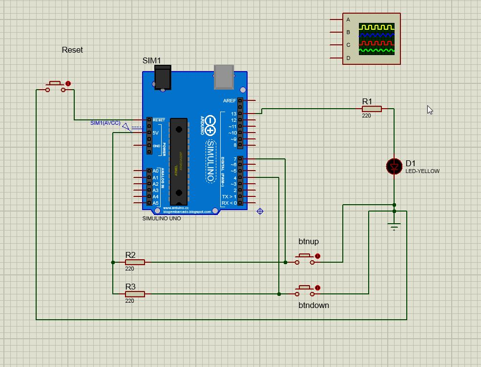

# Blink do LED em 1s, acelera/desacelra blink conforme pressionado os botões

* Não possui controle de Debounce para pressionamento dos botões 
* Quando pressionado os dois botões, em intervalo de até 500ms, mantém o LED acesso
* Utiliza função Millis() para controle do estado do botão

  

<!--
By Alisson Cavalcante e Silva
16/09/2018
-->
