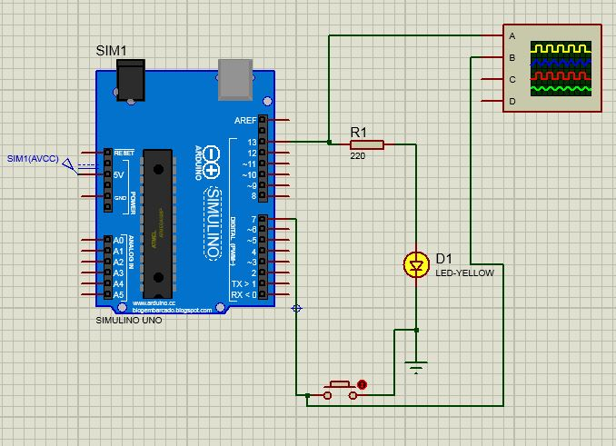

# Blink do LED em 1s Utilizando Registradores 

* Pisca o LED a cada 1s
* Se pressionado o botão segura os estado do LED acesso por 5s
* Feito Debounce no pressionamento do botão
* Utilizado função Millis() para alternar estado do LED

  

<!--
By Alisson Cavalcante e Silva
16/09/2018
-->
