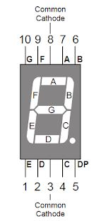

# Softpot e display 7 seg com servomotor e uso de Registradores

* Circuito e mque foi utilizado 2 atudadores e 2 sensores:
  * 1 - 2 botões funcionando como sensores;
  * 2 - 1 sofftpot (trimpot sensível ao toque) funcionando como senso;
  * 3 - 1 servo motor funcionando como atuador;
  * 4 - 1 display de 7 segmentos funcionando como atuador.
* Foram utilizados registradores para entrada e saida de dados.
  
  

  

<!--
By Alisson Cavalcante e Silva
23/09/2018
-->
