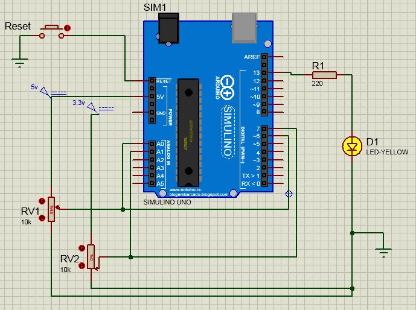

# Comparador Analógico com Registradores

* Circuito que realiza a comparação de dois valores de voltagem
  * Possui um potenciômetro que torna um dos valores variáveis
  * Da comparação dos dois valores o resultado acende ou apaga um LED
  
  
 

<!--
By Alisson Cavalcante e Silva
03/10/2018
-->
