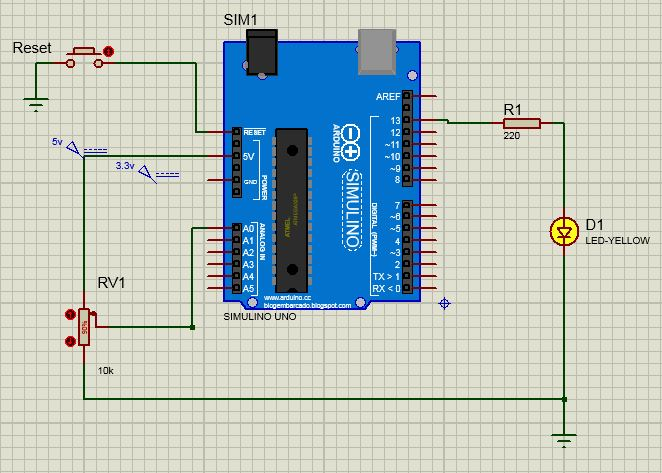

# Coversor Analógico com Potenciômetro e uso de Registradores

* Circuito que faz o LED piscar com delay configurado de acordo com voltagem na entrada analógica
  * Realiza instruções diretamente para os registradores dados
  * Entrada analógica recebe voltagem variável de aordo com saida do potenciômetro
  
  
 

<!--
By Alisson Cavalcante e Silva
03/10/2018
-->
