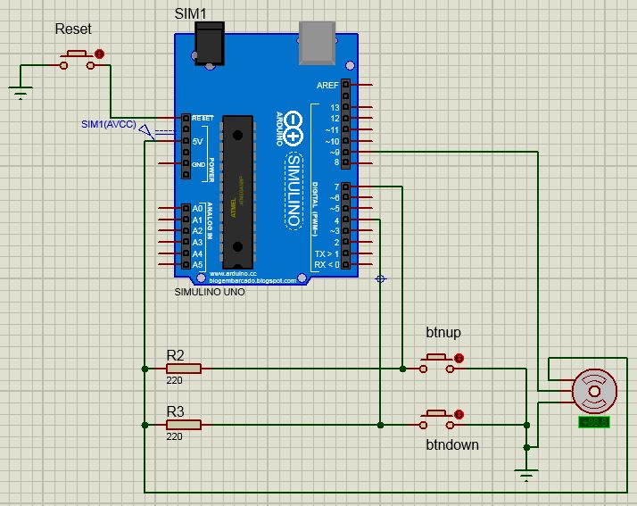

# Servo Motor com dois pushbutton

* Circuito utilizado para movimentar servomotor
* O servomotor começa na posição de 40º graus
* Possui dois botões pushbuttons:
	* Cada vez que o pushbutton A é pressionado o servomotor gira 20º graus até a posição 180º graus; e
	* Cada vez que o pushbutton B é pressionado o servomotor gira 20º graus até a posição 40º graus.

  

<!--
By Alisson Cavalcante e Silva
16/09/2018
-->
