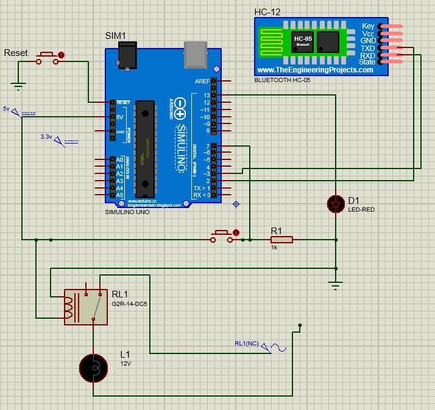

# Projeto Final - Controle Automatizado para Escritórios e Laboratórios por meio de Redes de RF with use Arduino

* Circuito:
  * Módulo HC-12
  * Led
  * Push button
  * Rele de 5v
  * Lâmpada de 110v
  
* Utilizaçã ode 2 Arduinos
  
  

  

<!--
By Alisson Cavalcante e Silva
11/11/2018
-->
